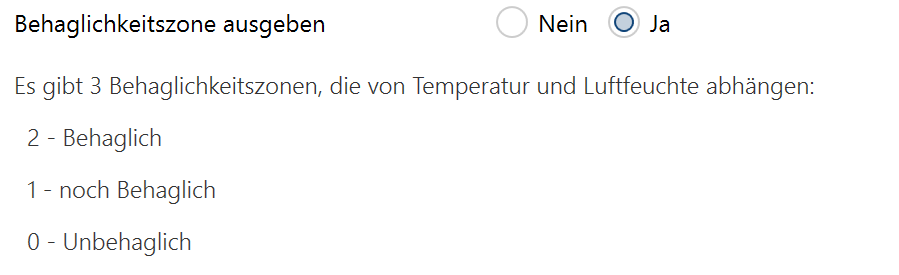

<!-- 
cSpell:words knxprod Masifi SAMD21 einheitenlos Luftfeuchtesensor engl Pieptönen
cSpell:words Glättungsfunktion Glättungsformel Behaglichkeitszone Behaglichkeitszonen Kalibrierungswerte Kalibrierungsfortschritt Kalibrierungsdaten KalibrierungLoeschen Bitleiste Behaglichkeitswert Kalibrierungsgrad
 -->

# **Applikationsbeschreibung Sensor**

Die Applikation für das SensorModule erlaubt die Parametrisierung des Sensormoduls mittels der ETS.

**Weitere Dokumente zur Applikationsbeschreibung:**
Die nicht Sensor-spezifischen Teile der Applikation basieren auf anderen OpenKNX-Modulen und sind jeweils dort beschrieben:
* [OneWireGateway](https://github.com/OpenKNX/OAM-OneWireModule/blob/main/doc/Applikationsbeschreibung-Wire.md) (*nicht in Variante SensorModule-Vpm*)
* [Präsenz](https://github.com/OpenKNX/OAM-PresenceModule/blob/main/doc/Applikationbeschreibung-Praesenz.md) (*nicht in Variante SensorModule-OneWire*) 
* [LogikModule](https://github.com/OpenKNX/OAM-LogicModule/blob/main/doc/Applikationsbeschreibung-Logik.md)

## Inhalte
> Achtung: Nachfolgende Auflistung teilweise abweichend von Reihenfolge im Dokument
* [Änderungshistorie](#änderungshistorie)
* [Einführung](#einführung)
  * [Funktionsumfang](#funktionsumfang)
* [ETS Konfiguration](#ets-konfiguration) (Übersicht aller Konfigurationsseiten und Links zu Detailbeschreibung)
  * [Kommunikationsobjekte](#übersicht-der-vorhandenen-kommunikationsobjekte)
  * [Update der Applikation](#update-der-applikation)
* [Unterstützte Hardware](#hardware-1)

### ETS Konfiguration
* **+ [Allgemeine Parameter](#allgemeine-parameter)**
  * [Gerätestart](#gerätestart)
  * [Installierte Hardware](#installierte-hardware)
    * [1-Wire aktivieren?](#1-wire-aktivieren)
    * [Akustischer Signalgeber vorhanden (Buzzer)?](#akustischer-signalgeber-vorhanden-buzzer)
    * [Optischer Signalgeber vorhanden (RGB-LED)?](#optischer-signalgeber-vorhanden-rgb-led)
  * [**Experteneinstellungen**](#experteneinstellungen)
* **+ [Standardsensoren](#standardsensoren)**
  * Konfiguration Standardsensoren am Beispiel Temperatur
    * [~ anpassen (interner Messwert)](#temperatur-anpassen-interner-messwert)
    * [Externe Werte](#externe-werte)
    * [Sendeverhalten](#sendeverhalten)
    * [Glättungsfunktion](#glättungsfunktion)
  * **[Temperatur](#standardsensoren---temperatur)**
  * **[Luftfeuchte](#standardsensoren---luftfeuchte)**
  * **[Luftdruck](#standardsensoren---luftdruck)**
  * **[Voc](#standardsensoren---voc)**
  * **[CO2](#standardsensoren---co2)**
  * **[Helligkeit](#standardsensoren---helligkeit)**
  * **[Entfernung](#standardsensoren---entfernung)**
  * **[Zusatzfunktionen](#standardsensoren---zusatzfunktionen)**
    * [Taupunkt berechnen](#taupunkt-berechnen)
    * [Behaglichkeitszone ausgeben](#behaglichkeitszone-ausgeben)
    * [Luftqualitätsampel ausgeben](#luftqualitätsampel-ausgeben)
    * [Kalibrierungsfortschritt ausgeben](#kalibrierungsfortschritt-ausgeben)
    * [Kalibrierungsdaten löschen](#kalibrierungsdaten-löschen)
* **+ 1-Wire** (siehe [Dokumentation zum OneWireGateway](https://github.com/OpenKNX/OAM-OneWireModule/blob/main/doc/Applikationsbeschreibung-Wire.md); Achtung: Version beachten!)
* **+ PM-Kanäle** (siehe [Dokumentation zum PresenceModule](https://github.com/OpenKNX/OAM-PresenceModule/blob/main/doc/Applikationbeschreibung-Praesenz.md); Achtung: Version beachten!)
* **+ Logikkanäle** (siehe [Dokumentation zum Logikmodul](https://github.com/OpenKNX/OAM-LogicModule/blob/main/doc/Applikationsbeschreibung-Logik.md); Achtung: Version beachten!)

## **Änderungshistorie**

Im folgenden werden Änderungen an dem Dokument erfasst, damit man nicht immer das Gesamtdokument lesen muss, um Neuerungen zu erfahren.

24.07.2024: Firmware 3.1, Applikation 3.1

* Aktualisierung vom Logikmodul auf die Version 3.3.1
* Aktualisierung vom Präsenzmelder auf die Version 3.2.2
* Aktualisierung vom virtuellen Taster auf 0.5

08.06.2024: Firmware 3.0, Applikation 3.0

* NEU: CO2-Sensor SDC41 erlaubt jetzt eine Einstellung des Messintervalls 
* NEU: Binäreingänge vom  

09.10.2023: Firmware 1.5.2, Applikation 1.5

* Aktualisierung auf die neuste Logikmodul-Version 1.6, siehe dortige Änderungshistorie
* Das SensorModule-Vpm bzw. SensorModule-Big enthält die neuste PresenceModule-Version 1.12. 
* Das Sensormodul unterstützt jetzt auch die Hardware für den RealPresence, damit dort auch andere I²C-Sensoren als nur ein Helligkeitssensor genutzt werden können. 

24.09.2023: Firmware 1.3.4, Applikation 1.3

* FIX: Zyklisches senden von Temperaturen funktionierte nicht korrekt, weil in der Berechnung für den Vergleichswert fälschlicherweise gerundet wurde.
* FIX: Die Berechnung der Behaglichkeitszone ist jetzt genauer, da die nicht gerundete Temperatur einfließt.

* Alle enthaltenen Module behalten ihre Versionen.

29.08.2023: Firmware 1.1.3, Applikation 1.1

* Aktualisierung auf die neuste Logikmodul-Version 1.5.3.
* Das SensorModule-Vpm bzw. SensorModule-Big enthält die neuste PresenceModule-Version 1.11.3. 
* Die SensorModule-OneWire- und -Big-Versionen enthalten die aktuelle OneWireModule-Version 1.0.

* FIX: Der KNX-Stack ist jetzt wesentlich robuster bei hoch ausgelastetem KNX-Bus. 
* FIX: Einige wenige DPT9-Werte ungleich 0 wurden vom KNX-Stack als 0 gesendet. Das ist gelöst. Es waren Werte der Form &pm;(2n)/100 für n>10, also z.B. &pm;20.48, &pm;40.96, &pm;81.92, &pm;163.84, &pm;327.68, &pm;655.36 usw. 
* Anmerkung: Der DPT9-Fehler im KNX-Stack war auch die Ursache für einen im Sensormodul immer wieder auftretenden 0-Wert bei der Glättungsfunktion der einzelnen Sensoren. Dieser Fehler ist somit auch behoben.

18.02.2023: Firmware 1.0, Applikation 1.0

* Anpassungen für 3 Varianten der Applikation:
  * Als Sensor-, 1-Wire- und Logik-Applikation (SensorModule-OneWire) 
  * Als Sensor-, Vpm- und Logik-Applikation (SensorModule-Vpm)
  * Als Sensor-, Vpm-, 1-Wire- und Logik-Applikation (SensorModule-Big)
  * Die ersten beiden sind vornehmlich dafür da, auf einem SAMD-Sensormodul zu laufen
  * SensorModule-Big sollte für alle RP2040-Varianten benutzt werden
* NEU: Als Helligkeitssensor wird jetzt auch der VEML7700 unterstützt.
* Aktualisierung auf die neuste Logikmodul-Version 1.4.2.
* Die SensorModule-OneWire- und -Big-Versionen enthalten die neuste OneWireModule-Version 1.0.
* Das SensorModule-Big enthält die neuste PresenceModule-Version 1.7.6.  

09.01.2023: Firmware 0.11, Applikation 0.11 (Beta)

* initiales Release als OpenKNX SensorModule
* Basiert auf dem [Vorgänger-Sensormodul](https://github.com/mumpf/knx-sensor) version 3.8 (im Folgenden stehen die Neuerungen gegenüber 3.8)
* Erzeugung von Firmware und knxprod wurde stark vereinfacht
* (intern) verbesserte Kommunikation mit dem KNX-Bus
* ETS-Applikation wird auch mit der ETS 6 getestet
* Eingänge können jetzt auch beliebige Kommunikationsobjekte der gesamten Applikation (nicht nur des Logikmoduls) sein, keine Verbindung über GA nötig
* Die ETS-Applikation wurde optisch überarbeitet und übersichtlicher gestaltet
* ETS-Kanäle werden neu unterstützt
* Es wird technisch überprüft, ob die ETS-Applikation mit der installierten Firmware übereinstimmt
* **Wichtig:** Diese Version ist eine komplett neue Applikation und somit nicht kompatibel zu der früheren Version 3.8. Die ETS-Applikation muss komplett neu parametrisiert werden.

## **Einführung**

Die vorliegende Applikation erlaubt die Parametrisierung von vielerlei Sensoren, vorrangig zur Ermittlung vom Raumklima, Helligkeit und Entfernung.

Sie ist auf unterschiedlicher OpenKNX-Hardware lauffähig, beispielweise das Sensormodul von Masifi oder dem Präsenz-Multisensor von ab-tools.

### **Funktionsumfang**

<!-- DOCCONTENT
Eine vollständige Applikationsbeschreibung ist unter folgendem Link verfügbar: https://github.com/OpenKNX/OFM-PresenceModule/blob/v1/doc/Applikationsbeschreibung-Sensor.md

Weitere Produktinformationen sind in unserem Wiki verfügbar: https://github.com/OpenKNX/OpenKNX/wiki/Produktinfo-Sensormodul
DOCCONTENT -->

Das Sensormodul erlaubt die Ausgabe verschiedener Sensorwerte auf den Bus. Dabei werden die in KNX üblichen Manipulationen der Sensorwerte unterstützt. Unterstützt werden:

* Sensoren zur

  * Temperaturmessung
  * Luftfeuchtemessung
  * Luftdruckmessung
  * VOC-Messung
  * CO2-Messung
  * Helligkeitsmessung
  * Entfernungsmessung

* Konfigurationen
 
  * Messwert anpassen (verschieben und einen positiven oder negativen Wert)
  * bis zu 2 weitere Messwerte berücksichtigen (Mittelwertbildung mit frei einstellbaren Anteilen pro Messwert)
  * zyklisch Senden
  * bei absoluter Abweichung senden
  * bei relativer (prozentueller) Abweichung senden
  * Messwert glätten

* Abgeleitete (berechnete) Messwerte

  * Taupunkt (wenn Temperatur und Luftfeuchte gegeben ist)
  * Behaglichkeit (abgeleitet aus Temperatur und Luftfeuchte)
  * Luftgüte (aus VOC- oder CO2 abgeleitet)

* Sensorspezifische Zusatzfunktionen

Weitere KNX-Übliche Funktionen wie Schwellwertschalter, Hystereseschalter, auch mit über den Bus einstellbaren Schwellwerten, können über das beiliegende Logikmodul einfach abgebildet werden.

## **Sensormodul als eigene Applikation**

Das Sensormodul hat auch eine eigene ETS-Applikation, die es erlaubt, das Sensormodul ohne Einbettung in eine andere Applikation zu verwenden. In diesem Fall hat es zusätzliche Untermodule, einige davon sind standardmäßig in OpenKNX-Applikationen verfügbar: 

### **OpenKNX**

Dies ist eine Seite mit allgemeinen Parametern, die unter [Applikationsbeschreibung-Common](https://github.com/OpenKNX/OGM-Common/blob/v1/doc/Applikationsbeschreibung-Common.md) beschrieben sind. 

### **Konfigurationstransfer**

Der Konfigurationstransfer erlaubt einen

* Export von Konfigurationen von OpenKNX-Modulen und deren Kanälen
* Import von Konfigurationen von OpenKNX-Modulen und deren Kanälen
* Kopieren der Konfiguration von einem OpenKNX-Modulkanal auf einen anderen
* Zurücksetzen der Konfiguration eines OpenKNX-Modulkanals auf Standardwerte

Die Funktionen vom Konfigurationstransfer-Modul sind unter [Applikationsbeschreibung-ConfigTransfer](https://github.com/OpenKNX/OFM-ConfigTransfer/blob/v1/doc/Applikationsbeschreibung-ConfigTransfer.md) beschrieben.

### **Präsenzmelder**

Die Sensormodul-Applikation erlaubt die Nutzung von einigen Präsenzmelder-Kanälen. Bei der Verwendung mit passender Hardware - wie dem Presence-Multisensor von ab-tools - auch als echter Präsenzmelder, sonst als virtueller Präsenzmelder (VPM).

Die Funktionen des Präsenzmelder-Moduls sind unter [Applikationsbeschreibung-Präsenz](https://github.com/OpenKNX/OFM-PresenceModule/blob/v1/doc/Applikationbeschreibung-Praesenz.md) beschrieben.

### **Virtuelle Taster**

Ebenso wie virtuelle Präsenzmelder werden auch virtuelle Taster von der Sensormodul-Applikation angeboten. Wenn auch Binäreingänge in Hardware vorhanden sind - wie dem Sensormodul v4.2 von SmartMF - können es auch echte Taster werden.

Die Funktionen des Tastermoduls sind unter [Applikationsbeschreibung-Taster](https://github.com/OpenKNX/OFM-VirtualButton/blob/v1/doc/Applikationsbeschreibung-Taster.md) beschrieben.

### **Binäreingänge**

Die Sensormodul-Applikation unterstützt auch Binäreingänge, z.B. vom Sensormodul v4.2 von SmartMF.

Die Funktionen der Binäreingänge sind unter [Applikationsbeschreibung-Binäreingang](https://github.com/OpenKNX/OFM-BinaryInput/blob/v1/doc/Applikationsbeschreibung-Binaereingang.md) beschrieben.

### **Logiken**

Wie die meisten OpenKNX-Applikationen enthält auch die Sensormodul-Applikation ein Logikmodul.

Die Funktionen des Logikmoduls sind unter [Applikationsbeschreibung-Logik](https://github.com/OpenKNX/OFM-LogicModule/blob/v1/doc/Applikationsbeschreibung-Logik.md) beschrieben.

## **Sensoren**

Alle Funktionen vom Sensormodul finden sich unter der Seite "Sensoren" wieder.

### **Allgemein**

Auf dieser Seite wird die Version des Sensormoduls angegeben, die die Firmware verwendet.

#### **Installierte Hardware**

Die Firmware im Sensormodul unterstützt verschiedene Hardware-Sensor-Typen.
Über die folgenden Felder kann angegeben werden, welcher der Messwerte durch welchen mit dem Sensormodul verbunden Sensor ermittelt werden soll.

**Die Angaben in diesem Teil müssen der vorhandenen Hardware entsprechen**, da sie das Verhalten der Applikation und auch der Firmware bestimmen. **Das Applikationsprogramm hat keine Möglichkeit, die Korrektheit der Angaben zu überprüfen.**

Falsche Angaben können zu falschen Konfigurationen der Applikation und somit zum **Fehlverhalten des Sensormoduls** führen.

Das Sensormodul kann 7 verschiedene Standardmesswerte liefern, die von verschiedenen Hardware-Sensoren ermittelt werden können:

* Temperatur (in °C)
* Luftfeuchte (in %)
* Luftdruck (in mBar)
* VOC (einheitenlos)
* CO2 (in ppm)
* Helligkeit (in Lux)
* Entfernung (in mm)

Es werden bestimmte Hardware-Sensoren unterstützt, deren Messwerte gelesen und entsprechend auf den Bus geschickt werden können.

Die unterstützten Sensoren liefern folgende Messwerte:

Sensorauswahl | Temperatur | Luftfeuchte | Luftdruck | VOC | CO2 | Helligkeit | Entfernung
---|:---:|:---:|:---:|:---:|:---:|:---:|:---:
SHT3x   | X | X |   |   |   |
BME280  | X | X | X |   |   |
BME680  | X | X | X | X | X2)
SCD304)   | X | X |   |   | X |
SCD4x3)   | X | X |   |   | X |
SGP301)   | X | X | | X | X2)
IAQCore | | | | X | X2)
OPT300x | | | | | |  X
VEML7700 | | | | | |  X
VL53L1X | | | | | |  | X

1)Noch in Entwicklung, die ETS Applikation unterstützt bereits die Einstellungen, die Firmware kann diese Sensoren noch nicht auswerten.

2)Bei diesem Sensor wird der CO2-Wert nicht gemessen, sondern aus dem VOC-Wert berechnet. Die Berechnung findet nicht im Sensormodul, sondern im Sensor selbst statt.

3)SCD4x meint die Sensoren SCD40 oder SCD41

4)Der SCD30 wird weiterhin unterstützt, für diejenigen, die diesen Sensor bereits benutzen. Allerdings wird dieser Sensor für eine Neuanschaffung *nicht empfohlen*, da er unzuverlässig funktioniert.

In den folgenden Auswahlfeldern kann man für jeden Standardmesswert bestimmen, von welchem Sensor dieser Messwert geliefert werden soll. Dabei können verschiedene Sensoren kombiniert werden. Bestimmte Kombinationen beeinflussen die Funktionsweise weiterer am Sensormodul angeschlossener Hardware. Solche Kombinationen führen zu Warnmeldungen.

Die Kombination vom BME280 und BME680 ist nicht möglich, da diese Sensoren die gleiche physikalische Adresse haben und somit nicht beide gleichzeitig angeschlossen werden können. Es ist aber keine Einschränkung, da der BME680 auch alle Messwerte liefern kann, die der BME280 liefert.

Sollten beide Sensoren BME280 und BME680 ausgewählt worden sein, erscheint folgende Fehlermeldung:
<kbd></kbd>

> **Achtung**: Die Möglichkeit, Sensoren für Standardmesswerte auszuwählen ermöglicht viele Sensor-Messwert-Kombinationen, die nicht alle vor einem Release getestet werden können. In der folgenden Tabelle werden Sensor-Messwert-Kombinationen angegeben, die bereits erfolgreich geprüft wurden und funktionieren. Ferner können weitere funktionierende Sensor-Messwert-Kombinationen im KNX-User-Forum ausgetauscht werden.

| Kombi  | Temperatur | Luftfeuchte | Luftdruck |   VOC   | CO2 | Helligkeit | Entfernung |
|:------:|:----------:|:-----------:|:---------:|:-------:|:--------------:|:----------:|:----------:|
|   1    |   SHT3x    |    SHT3x    |           |         |                |            |            |         
|   2    |   BME280   |   BME280    |  BME280   |         |                |            |            |         
|   3    |   BME680   |   BME680    |  BME680   | BME680  |     BME680     |            |            |         
|   4    |   SCD4x    |    SCD4x    |           |         |     SCD4x      |            |            |         
|   5    |            |             |           | IAQCore |                |            |            |         
|   6a   |            |             |           |         |                |  OPT300x   |            |          
|   6b   |            |             |           |         |                |  VEML7700  |            |          
|   7    |            |             |           |         |                |            |  VL53L1X   |
|   8    |   SHT3x    |    SHT3x    |           |         |                |  OPT300x   |            |
|   9    |   SHT3x    |    SHT3x    |           |         |                |  VEML7700  |            |
|   10   |   BME280   |   BME280    |  BME280   | IAQCore |                |            |            |
|   11   |   BME280   |   BME280    |  BME280   |         |     SCD4x      |            |            |
|   12   |   BME680   |   BME680    |  BME680   | BME680  |     SCD4x      |            |            |
|   13   |   SCD4x    |    SCD4x    |  BME280   |         |     SCD4x      |            |            |
|   14   |   SCD4x    |    SCD4x    |  BME680   | BME680  |     SCD4x      |            |            |

Die in den Tabellen angegebenen Kombinationen sagen nichts darüber aus, ob die Sensoren direkt an das Sensormodul angeschlossen werden können. Stellenweise wurde mit zusätzlicher Hardware getestet, die einen Sensoranschluss ermöglichte.

>Die Verwendung von SCD30 als Sensor, vor allem in Kombination mit weiteren Sensoren, wird nur mit eingeschaltetem Watchdog empfohlen, da der Betrieb vom SCD30 manchmal zu unerwünschten "Hängern" des Sensormoduls führt. Statt des SCD30 sollte der SDC4x genutzt werden, da er günstiger ist und zuverlässiger funktioniert.

<kbd></kbd>

#### **Temperatursensor**

Dieses Auswahlfeld erlaubt die Auswahl des Sensors, der die Temperatur liefern soll. Ein entsprechendes Kommunikationsobjekt (KO) zum lesen bzw. senden erscheint in der Liste der Kommunikationsobjekte.

Wird "Kein Sensor" ausgewählt, wird die Temperatur nicht ermittelt.

Nur wenn ein Sensor für die Ermittlung der Temperatur ausgewählt wurde, erscheint eine Seite "Temperatur", auf der passende Einstellungen zum Messwert gemacht werden können.

#### **Luftfeuchtesensor**

Dieses Auswahlfeld erlaubt die Auswahl des Sensors, der die Luftfeuchte liefern soll. Ein entsprechendes Kommunikationsobjekt (KO) zum lesen bzw. senden erscheint in der Liste der Kommunikationsobjekte.

Wird "Kein Sensor" ausgewählt, wird die Luftfeuchte nicht ermittelt.

Nur wenn ein Sensor für die Ermittlung der Luftfeuchte ausgewählt wurde, erscheint eine Seite "Luftfeuchte", auf der passende Einstellungen zum Messwert gemacht werden können.

#### **Luftdrucksensor**

Dieses Auswahlfeld erlaubt die Auswahl des Sensors, der den Luftdruck liefern soll. Ein entsprechendes Kommunikationsobjekt (KO) zum lesen bzw. senden erscheint in der Liste der Kommunikationsobjekte.

Wird "Kein Sensor" ausgewählt, wird der Luftdruck nicht ermittelt.

Nur wenn ein Sensor für die Ermittlung des Luftdrucks ausgewählt wurde, erscheint eine Seite "Luftdruck", auf der passende Einstellungen zum Messwert gemacht werden können.

#### **Voc-Sensor**

Dieses Auswahlfeld erlaubt die Auswahl des Sensors, der den Messwert für flüchtige organischen Verbindungen (engl. volatile organic compounds, kurz Voc) liefern soll. Ein entsprechendes Kommunikationsobjekt (KO) zum lesen bzw. senden erscheint in der Liste der Kommunikationsobjekte.

Wird "Kein Sensor" ausgewählt, wird der Voc-Wert nicht ermittelt.

Nur wenn ein Sensor für die VOC-Ermittlung ausgewählt wurde, erscheint eine Seite "VOC", auf der passende Einstellungen zum Messwert gemacht werden können.

#### **Co2-Sensor**

Dieses Auswahlfeld erlaubt die Auswahl des Sensors, der den Messwert für Kohlendioxid (CO2) liefern soll. Ein entsprechendes Kommunikationsobjekt (KO) zum lesen bzw. senden erscheint in der Liste der Kommunikationsobjekte.

Wird "Kein Sensor" ausgewählt, wird der CO2-Wert nicht ermittelt.

Nur wenn ein Sensor für die CO2-Ermittlung ausgewählt wurde, erscheint eine Seite "CO2", auf der passende Einstellungen zum Messwert gemacht werden können.

Bei der Auswahl vom BME680, IAQCore oder SGP30 ist anzumerken, dass diese Sensoren nur ein berechnetes CO2-Äquivalent passend zum gemessenen Voc-Wert ausgeben und keinen gemessenen CO2-Wert.

#### **Helligkeitssensor**

Dieses Auswahlfeld erlaubt die Auswahl des Sensors, der die Helligkeit liefern soll. Ein entsprechendes Kommunikationsobjekt (KO) zum lesen bzw. senden erscheint in der Liste der Kommunikationsobjekte.

Wird "Kein Sensor" ausgewählt, wird die Helligkeit nicht ermittelt.

Nur wenn ein Sensor für die Ermittlung der Helligkeit ausgewählt wurde, erscheint eine Seite "Helligkeit", auf der passende Einstellungen zum Messwert gemacht werden können.

#### **Entfernungssensor**

Dieses Auswahlfeld erlaubt die Auswahl des Sensors, der die Entfernung liefern soll. Ein entsprechendes Kommunikationsobjekt (KO) zum lesen bzw. senden erscheint in der Liste der Kommunikationsobjekte.

Wird "Kein Sensor" ausgewählt, wird die Entfernung nicht ermittelt.

Nur wenn ein Sensor für die Ermittlung der Entfernung ausgewählt wurde, erscheint eine Seite "Entfernung", auf der passende Einstellungen zum Messwert gemacht werden können.

<!-- ### **Fehlerobjekt anzeigen**

Das Fehlerobjekt (KO 11) meldet bitweise Sensorfehler.

* Bit 0: Fehler in der Logik (Zyklus, der nicht aufgelöst werden kann)
* Bit 1: Fehler bei der Messung der Temperatur
* Bit 2: Fehler bei der Messung der Luftfeuchte
* Bit 3: Fehler bei der Messung des Luftdrucks
* Bit 4: Fehler bei der Messung der Voc
* Bit 5: Fehler bei der Messung vom CO2
* Bit 6: Derzeit nicht belegt
* Bit 7: Fehler im 1-Wire-Busmaster
* Bit 8-15: Fehler des jeweiligen 1-Wire-Sensors -->

## Messwert

Alle Messwerte (Temperatur, Luftfeuchte, Luftdruck, Voc, CO2, Helligkeit und Entfernung) erlauben die gleichen Einstellungen, die im Folgenden abstrakt für einen beliebigen Messwert beschrieben werden. Für die konkreten Messwerte werden dann nur noch die Einheiten genannt, in den die Eingaben zu erfolgen sind.

<!-- DOC HelpContext="Messwert anpassen" -->
### **Messwert anpassen (interner Messwert)**

Mit dieser Einstellung kann der Sensor kalibriert werden. Der eingegebene Wert wird zum gemessenen Wert addiert. die möglichen Eingabegrenzen und die Einheit werden bei dem konkreten Messwert beschrieben.

## Externe Werte

<!-- DOC -->
### **Externe Messwerte berücksichtigen**

Es können bis zu 2 externe Messwerte mit dem intern gemessenen verrechnet werden und als Gesamtmesswert ausgegeben werden. Dabei kann angegeben werden, in welchem Verhältnis die externen und der interne Messwert zueinander stehen. Eine Angabe von 60:30:10 würde bedeuten, dass der interne Messwert zu 60%, der externe Messwert 1 zu 30% und der externe Messwert 2 zu 10% in den Gesamtmesswert einfließt. Es sind aber auch durchaus Angaben wie 12:6:2 möglich (gleichbedeutend zu 60:30:10).

Solange ein externer Messwert noch nicht empfangen wurde, ist sein Anteil (nicht sein Wert) 0, wird also beim Gesamtergebnis nicht berücksichtigt.

In der Auswahlbox wird angegeben, ob 0, 1 oder 2 externe Messwerte berücksichtigt werden sollen.

<!-- DOC -->
#### **Anteil interner Messwert**

<!-- DOC Skip="1" -->
Erscheint nur, wenn externe Werte berücksichtigt werden sollen. 

Gibt den Anteil des internen Messwerts am Gesamtmesswert an.

<!-- DOC -->
#### **Anteil externer Messwert 1**

<!-- DOC Skip="1" -->
Erscheint nur, wenn externe Werte berücksichtigt werden sollen. 

Gibt den Anteil des ersten externen Messwerts am Gesamtmesswert an.

<!-- DOC -->
#### **Anteil externer Messwert 2**

<!-- DOC Skip="1" -->
Erscheint nur, wenn 2 externe Werte berücksichtigt werden sollen. 

Gibt den Anteil des zweiten externen Messwerts am Gesamtmesswert an.

<!-- DOC -->
#### **Externe Messwerte beim Start lesen**

<!-- DOC Skip="1" -->
Erscheint nur, wenn externe Werte berücksichtigt werden sollen. 

Ein "Ja" führt zu einem Lesen der externen Werte beim Neustart des Gerätes. Siehe hier auch Allgemeine Einstellungen -> Zeit bis das Gerät nach einem Neustart aktiv wird.

## Sendeverhalten

<!-- DOC HelpContext="Messwert zyklisch senden" -->
### **Messwert zyklisch senden (0 = nicht senden)**

Der Messwert kann in bestimmten Zeitintervallen auf den Bus gesendet werden. Hier wird das Zeitintervall in Sekunden angegeben.

Wird eine 0 angegeben, wird die Temperatur nicht zyklisch gesendet.

<!-- DOC HelpContext="Messwert bei absoluter Abweichung senden" -->
### **Messwert bei absoluter Abweichung senden (0 = nicht senden)**

Der Messwert kann auch gesendet werden, wenn der aktuell gemessene Wert um eine festgelegte Differenz von dem zuletzt gesendeten Wert nach oben oder unten abweicht.

In welcher Einheit und welcher Genauigkeit der Messwert angegeben wird steht in der Dokumentation zum entsprechenden Messwert.

Wird eine 0 angegeben, wird bei einer absoluten Abweichung nicht gesendet.

<!-- DOC HelpContext="Messwert bei relativer Abweichung senden" -->
### **Messwert bei relativer Abweichung senden (0 = nicht senden)**

Der Messwert kann auch gesendet werden, wenn der aktuell gemessene Wert um einen bestimmten Prozentsatz von dem zuletzt gesendeten Wert nach oben oder unten abweicht.

Hier wird die Abweichung in % angegeben. Bei einem zuletzt gesendeten Wert von 20 und einen angegebenen Abweichung von 5% wird erneut gesendet, wenn der gemessene Messwert 21 überschreitet oder 19 unterschreitet (5% von 20 ergibt &pm;1).

Wird eine 0 angegeben, wird bei einer relativen Abweichung nicht gesendet.

## Glättungsfunktion

<!-- DOC HelpContext="Messwert glaetten" -->
### **Messewert glätten: P =**

Falls der Sensor zu empfindlich ist und man starke Schwankungen im Messwert hat, kann man eine Glättungsfunktion nutzen, um starke Messwertschwankungen abzumildern. Die hier verwendete Funktion ist vergleichbar mit einer Durchschnittsberechnung über eine gewisse Anzahl vergangener Messwerte, funktioniert aber im Detail anders.

<!-- DOCCONTENT
Für Details zur Berechnung der Glättung bitte in der Applikationsbeschreibung nachlesen.
DOCCONTENT -->
<!-- DOCEND -->
Es wird folgende Glättungsformel verwendet:

Xneu = Xalt + (M - Xalt) / P

wobei

* Xneu der geglättete Wert,
* Xalt der zuvor ermittelte geglättete Wert,
* M der aktuelle Messwert und
* P der einzugebende Glättungsfaktor

ist. Intern wird alle 5 Sekunden ein neuer Messwert ermittelt, der dann mittels dieser Formel geglättet wird. Ein P von 1 führt zu keiner Glättung, jeder Messwert wird übernommen. Ein Wert von 12 führt zu einer Glättung über die Werte einer Minute (5s * 12 = 60s), ein Wert von 120 zu einer Glättung von 10 Minuten und 720 zu einer Glättung von einer Stunde.

Die Glättung wird durchgeführt, bevor eine Sendebedingung für die absolute oder relative Abweichung ermittelt wird.

Der neu ermittelte Wert wird alle 5 Sekunden auf das entsprechende KO geschrieben, ganz egal, ob das KO diesen Wert sendet oder nicht. Somit können vom Sensormodul alle 5 Sekunden aktuelle Sensorwerte gelesen werden, unabhängig von parametrisierten Sendebedingungen.

## **Temperatur**

Alle Temperaturangaben werden in 0.1°C vorgenommen. Die Temperatur kann um &pm;10°C angepasst werden. Der eingegebene Wert ist dann &pm;100.

## **Luftfeuchte**

Alle Angaben für Luftfeuchte werden in % vorgenommen. Die Luftfeuchte kann um &pm;50% angepasst werden.

## **Luftdruck**

Erscheint nur, wenn der angeschlossene Sensor auch einen Messwert für Luftdruck liefert.

Alle Angaben für Luftdruck werden in Millibar (mBar) vorgenommen. Der Luftdruck kann um &pm;80 mBar angepasst werden.

## **Voc**

Erscheint nur, wenn der angeschlossene Sensor auch einen Messwert für Voc liefert.

Alle Angaben für Voc sind einheitenlos und werden in ganzen Zahlen vorgenommen. Der Voc-Wert kann um &pm;100 angepasst werden.

## **CO2**

Erscheint nur, wenn der angeschlossene Sensor auch einen Messwert für CO2 liefert.

Alle Angaben für CO2 werden in Parts-Per-Million (ppm) vorgenommen. Der CO2-Wert kann um &pm;120 ppm angepasst werden.

Anmerkung zum BME680: Dieser Sensor liefert nur ein berechnetes CO2-Äquivalent passend zum gemessenen Voc-Wert und keinen gemessenen CO2-Wert. Dieser berechnete CO2-Wert wird über ein zusätzliches KO 20 ausgegeben.

Ist die Sensorkombination BME680+SCD4x installiert, werden beide CO2-Werte ausgegeben, der gemessene und der berechnete.

> **Anmerkung zum SDC30:** Dieser Sensor wird nicht mehr empfohlen. Er sollte - wenn überhaupt - nur mit einem Watchdog genutzt werden (siehe Kapitel Watchdog-Unterstützung). Mit diesem Sensor kommt es zu sporadischen "Hängern", deren Ursache nicht bekannt ist. Für einen CO2-Sensor ist der SCD4x die bessere (und günstigere) Wahl.

## **Helligkeit**

Erscheint nur, wenn der angeschlossene Sensor auch einen Messwert für Helligkeit liefert.

Alle Angaben für Helligkeit werden in Lux vorgenommen. Die Helligkeit kann um &pm;120 Lux angepasst werden.

## **Entfernung**

Erscheint nur, wenn der angeschlossene Sensor auch einen Messwert für Entfernung liefert.

Alle Angaben für Entfernung werden in Millimeter (mm) vorgenommen. Die Entfernung kann um &pm;125 mm angepasst werden.

## **Zusatzfunktionen**

Das Sensormodul kann neben gemessenen Werten auch noch einige berechnete Werte liefern. Dazu zählen der Taupunkt, Behaglichkeit, Luftqualitätsampel und Messgenauigkeit.

<!-- DOC -->
### **Taupunkt berechnen**

<!-- DOC Skip="1" -->
<kbd></kbd>

Wenn man hier "Ja" auswählt, kann man für den Taupunkt Einstellungen wie unter Standardsensoren beschrieben vornehmen. Alle Angaben für den Taupunkt werden in 0.1°C vorgenommen.

<!-- DOC -->
### **Behaglichkeitszone ausgeben**

<!-- DOC Skip="1" -->
<kbd></kbd>

Wenn man hier "Ja" auswählt, wird anhand der Temperatur und Luftfeuchte eine Behaglichkeitszone berechnet und über KO 22 ausgegeben. Die Behaglichkeitszone kann jederzeit gelesen werden, wird aber nur bei Änderungen gesendet.

Falls zyklisches Senden gewünscht wird, kann man dies über die im Sensormodul enthaltenen Logikkanäle realisieren. Beispiele sind in der Applikationsbeschreibung Logik enthalten.

Folgende Behaglichkeitszonen werden berechnet:

* 2 - behaglich
* 1 - noch behaglich
* 0 - unbehaglich

<!-- DOC -->
### **Luftqualitätsampel ausgeben**

<!-- DOC Skip="1" -->
<kbd></kbd>

Dieser Punkt ist nur sichtbar, wenn ein angeschlossener Sensor Messwerte zur Luftqualität liefert, also nur beim BME680, SCD4x oder dem nicht empfohlenen SCD30.

Wenn man hier "Ja" auswählt, wird anhand des gemessenen Voc-Werts (beim BME680) oder des gemessenen CO2-Werts eine Luftqualitätsampel berechnet und über KO 23 ausgegeben. Die Luftqualitätsampel kann jederzeit gelesen werden, wird aber nur bei Änderungen gesendet.

Falls zyklisches Senden gewünscht wird, kann man dies über die im Sensormodul enthaltenen Logikkanäle realisieren. Beispiele sind in der Applikationsbeschreibung Logik enthalten.

Es gibt 6 Luftqualitätsgrade, entsprechend deutschen Schulnoten:

* 1 - sehr gut
* 2 - gut
* 3 - befriedigend (bei Gelegenheit lüften)
* 4 - ausreichend (lüften empfohlen)
* 5 - mangelhaft (lüften)
* 6 - ungenügend (unbedingt lüften)

### **Sensorspezifische Einstellungen**

In diesem Bereich kann man Einstellungen für einzelne Sensoren vornehmen, sofern diese das unterstützen.

<!-- DOC -->
#### **CO2 ermitteln alle**

<!-- DOC Skip="1" -->
Erscheint nur, wenn der CO2-Sensor SCD41 ausgewählt wurde.

Der CO2-Sensor SDC41 erlaubt die Einstellung des Messintervalls. Man kann bestimmen, alle wie viel Sekunden eine Messung vorgenommen wird. 

<!-- DOC -->
### **Kalibrierungsfortschritt ausgeben**

<!-- DOC Skip="3" -->
<kbd></kbd>

Wird nur sichtbar, wenn als Sensor BME680 ausgewählt ist.

Manche Sensoren benötigen eine Kalibrierung, bevor sie zuverlässige Werte ausgeben können. Dies ist besonders für die Erfassung von Voc-Werten notwendig. Das Sensormodul hat für den BME680 eine Selbstkalibrierung implementiert, die ununterbrochen parallel zur Messwerterfassung läuft und die bisher ermittelten Kalibrierungswerte in den nichtflüchtigen Speicher des Prozessors speichert. Somit wird verhindert, dass nach einem Neustart des Gerätes eine erneute Kalibrierung notwendig wird.

Bei einer Erstinbetriebnahme, nach dem Einspielen einen neuen Firmware oder in seltenen Fällen auch im normalen Betrieb ist es notwendig, dass sich der Sensor BME680 neu kalibriert. Dies ist daran zu erkennen, dass der Sensor für den Voc-Wert konstant eine 25 liefert und als Kalibrierungsfortschritt über das KO 24 der Wert 0% geliefert wird.

Nach ca. 5 Minuten werden die ersten Voc-Werte ungleich 25 geliefert mit einem Kalibrierungsfortschritt von 33%. Diese ersten Werte sind noch immer nicht sinnvoll zu verwenden.

Nach einiger Zeit (hängt von der Raumgröße, Luftqualität, Lüftungszustand etc. ab) geht der Kalibrierungsfortschritt auf 66%, gefolgt von einem Wert von 100%. Dies kann insgesamt 6 bis 48 Stunden dauern und entspricht einer normalen Funktion des BME680.

Der Kalibrierungsfortschritt kann mit dieser Einstellung zur Information über KO 24 ausgegeben werden, hat aber auf die Funktion keinerlei Einfluss.

<!-- DOC -->
### **Kalibrierungsdaten löschen**

<!-- DOC Skip="1" -->
<kbd></kbd>

Die Applikation erlaubt auch ein explizites Löschen der Kalibrierungsdaten. Allerdings wäre es sinnlos, hierfür einen Ja-Nein-Parameter einzuführen, da dieser, einmal auf Ja gestellt, nach jedem Neustart des Gerätes die Kalibrierungsdaten löschen würde. Insofern funktioniert dieser Parameter anders als normalerweise ETS-Parameter funktionieren.

Eine Änderung des Wertes von 17 auf 23 führt nach den nächsten Upload der Applikation zum Löschen der Kalibrierungsdaten. Diese werden dann automatisch wieder aufgebaut und bleiben auch erhalten, egal wie oft die Applikation danach wieder hochgeladen wird. Die Firmware des Gerätes verbindet die aktuellen Kalibrierungsdaten mit dem Wert des Parameters, solange der Parameter seinen Wert behält, sind auch die Kalibrierungsdaten gültig.

Wird irgendwann einmal der Wert wieder von 23 auf 17 geändert, werden die Kalibrierungsdaten wieder gelöscht, neu aufgebaut und mit dem Wert 17 verbunden. Will man somit wieder löschen, ändert man wieder auf 23 u.s.w.

Im Allgemeinen sollte es nicht nötig sein, die Kalibrierungsdaten zu löschen. Somit sollte dieser Parameter einfach unverändert bleiben.

## **Update der Applikation**

Die Sensormodul-Applikation unterstützt die ETS-Update-Funktion. Das bedeutet, man kann einen neue Applikationsversion (und falls nötig auch einen neue Firmware) einspielen, ohne die Applikation komplett neu parametrieren zu müssen.

Der Vorgang ist im [OpenKNX-Wiki](https://github.com/OpenKNX/OpenKNX/wiki/Wie-aktualisiert-man-eine-ETS-Applikation-auf-eine-aktuelle-Version) beschrieben.

